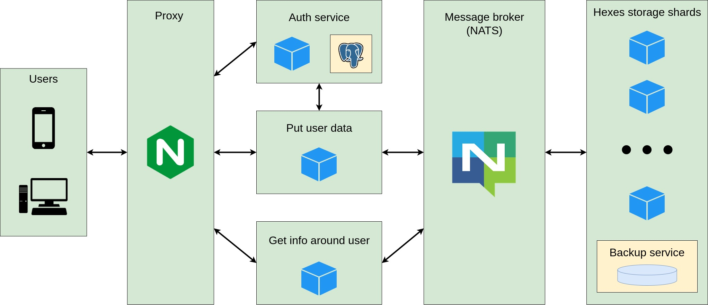

# Project "Safe Area"

System for collecting and processing information on the spread of viral diseases

## System architecture

  

## System components:
* [Auth service](https://github.com/safe-area/auth-service)
* [Data collector](https://github.com/safe-area/user-data-collector)
* [Data provider](https://github.com/safe-area/range-info)
* [Sharded in-memory data storage](https://github.com/safe-area/sa-storage)
